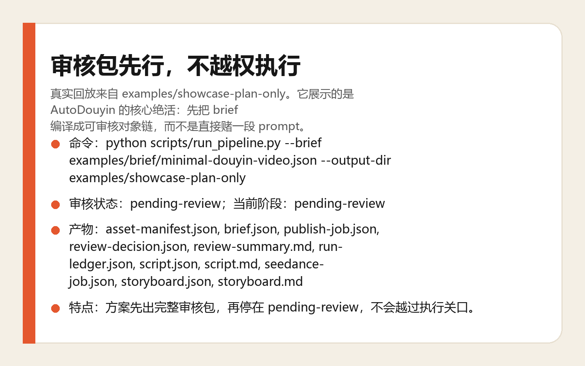
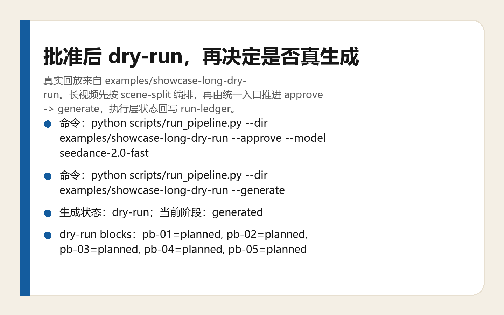
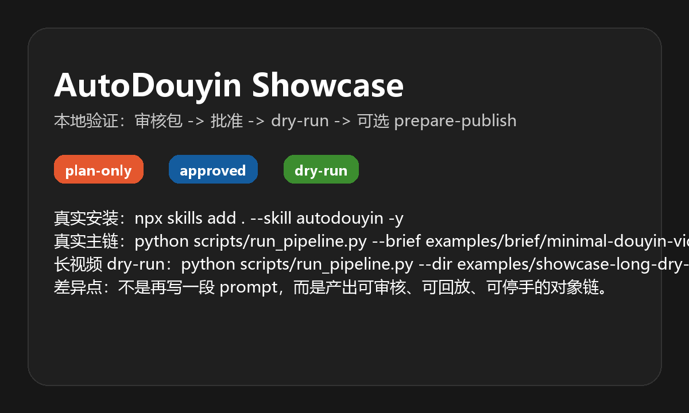

<!--
[INPUT]: 依赖 {README.md、assets、scripts 与 examples} 的 {对外英文发布说明}
[OUTPUT]: 对外提供 {AutoDouyin 的英文安装页、展示页与验证入口}
[POS]: {仓库根目录} 的 {英文 README}，与中文 README 同构，服务外部英文读者
[PROTOCOL]: 变更时更新此头部，然后检查 CLAUDE.md
-->

<sub>🌐 <a href="README.md">中文</a> · <b>English</b></sub>

<div align="center">

# AutoDouyin

> *"Stop gambling on one prompt. Run a reviewable production chain instead."*

[](SKILL.md)
[](LICENSE)
[](.codex-plugin/plugin.json)

**Compile a brief into a reviewable, replayable, stoppable short-video object chain instead of betting everything on one Seedance prompt.**

[See Output](#output-preview) · [Install](#quick-start) · [Triggers](#trigger-phrases) · [Why It Is Different](#how-it-differs-from-typical-seedance-skills) · [Safety](#safety-boundary)

</div>

---



<sub>These visuals are generated from real runs in `examples/showcase-plan-only/` and `examples/showcase-long-dry-run/` via `python scripts/build_showcase_assets.py`.</sub>

---

## What Problem It Solves

You write one Seedance 2.0 prompt. The first result drifts. The second breaks character consistency. By the third try, you realize there is no stable middle layer to review or revise.

The real problem is not that the prompt is weak. The problem is that **everything is packed into one natural-language blob**: brief, script, storyboard, asset references, generation task, publish task. You cannot review it cleanly, diff it safely, pause execution, or separate generation from publishing.

AutoDouyin changes the model: first compile a full review package, then move forward only after approval. The Seedance prompt is one artifact in the chain, not the whole system.

## Output Preview

Input:

```text
Create a 15-second 9:16 Douyin video about AI automatically producing short videos. Give me the plan first and do not execute anything yet.
```

Review package output:

| Artifact | File | Purpose |
|---|---|---|
| brief | `brief.json` | Normalized goal, mode, duration, ratio, and style preset |
| script | `script.json` + `script.md` | Deterministic structured script |
| storyboard | `storyboard.json` + `storyboard.md` | Timeline, camera codes, actions, audio |
| asset manifest | `asset-manifest.json` | C01/S01/P01 asset anchors and reference chain |
| seedance job | `seedance-job.json` | Prompt blocks, duration boundaries, style locks, identity strategy |
| publish job | `publish-job.json` | Douyin publish task: title, description, video path |
| review summary | `review-summary.md` | Human-readable review digest |
| review decision | `review-decision.json` | Approval gate: `pending-review` / `approved` / `changes-requested` / `rejected` |
| run ledger | `run-ledger.json` | Current stage, execution state, artifact chain, step log |

Dry-run showcase:



Shareable scorecard:



## Quick Start

Clone the repository first, then run one bootstrap command from the repo root:

```bash
# Windows
powershell -ExecutionPolicy Bypass -File scripts/bootstrap.ps1 -Profile core

# macOS / Linux
bash scripts/bootstrap.sh core
```

This step will:

- create a local `.venv`
- install Python dependencies: `jsonschema`, `Pillow`
- run a minimal smoke test: compile a review package and validate the artifacts

Recommended order after download:

```bash
# 1. Bootstrap the repo and verify core compilation
powershell -ExecutionPolicy Bypass -File scripts/bootstrap.ps1 -Profile core

# 2. Install it as an agent skill if you want agent invocation
npx skills add . --skill autodouyin -y
```

That local `skills add` command has already been validated in a temporary copy of the repo.

Once the repository is published to GitHub, replace that local install command with the real repository URL version.

If you want the full chain installed and checked in one go:

```bash
powershell -ExecutionPolicy Bypass -File scripts/bootstrap.ps1 -Profile all
```

That checks:

- Python + `jsonschema` + `Pillow`
- `seedance` CLI
- `ffmpeg`
- Node / npm
- `npm install` under `adapters/douyin-upload-vendor/`

The official Ark API path also requires `ARK_API_KEY`.

## Installation Profiles

| Profile | What it prepares | Best for |
|---|---|---|
| `core` | Python + `jsonschema` + `Pillow` | Compile review packages and validate outputs |
| `generate-cli` | `core` + checks `seedance` CLI | Seedance 2.0 CLI route |
| `generate-official` | `generate-cli` + `ARK_API_KEY` | Official Ark API route |
| `assemble` | `core` + checks `ffmpeg` | Long-video assembly and anchor still extraction |
| `publish` | Node/npm + vendor `npm install` | Douyin publish preparation page |
| `all` | Everything above | Full environment setup |

Examples:

```bash
# Core compilation and validation only
powershell -ExecutionPolicy Bypass -File scripts/bootstrap.ps1 -Profile core

# Install publish-side dependencies
powershell -ExecutionPolicy Bypass -File scripts/bootstrap.ps1 -Profile publish

# Full environment validation
powershell -ExecutionPolicy Bypass -File scripts/bootstrap.ps1 -Profile all
```

## Environment Doctor

If you want to inspect the environment before installing everything:

```bash
python scripts/doctor.py --profile core
python scripts/doctor.py --profile publish
python scripts/doctor.py --profile all --json
```

Environment variable template: [.env.example](.env.example)

## Trigger Phrases

- "Compile a Seedance task for this brief"
- "Turn this brief into a storyboard and Seedance job"
- "Plan a 15-second Douyin video, but do not execute it"
- "I already have a storyboard, now generate the Seedance job"
- "Create a 90-second long-video storyboard plan"
- "Prepare a publish task, the video is already generated"
- "Build the review package first, then I will approve execution"

## What It Delivers

| Mode | Deliverable | Meaning |
|---|---|---|
| `plan-only` | full review package | Stop at `pending-review` |
| `generate-only` | `seedance-job.json` + `run-ledger.json` | Continue generation from an existing storyboard or approved package |
| `publish-only` | `publish-job.json` + `run-ledger.json` | Prepare publishing from an existing final video |
| `end-to-end` | review package + generation + assembly + publish preparation | Still must pass the approval gate first |

## How It Differs From Typical Seedance Skills

| Dimension | Typical Seedance Skill | AutoDouyin |
|---|---|---|
| Core action | Write one prompt | Compile a reviewable object chain |
| Intermediate artifacts | Few or none | brief / script / storyboard / assets / review / jobs / ledger |
| Verification | Mostly visual inspection | JSON Schema + `validate_artifacts.py` + `run-ledger.json` |
| Long video | Manual splitting | Automatic `scene-split-edit-pipeline` |
| Approval gate | Often missing | `review-decision.json` blocks execution until approved |
| Publish boundary | Usually out of scope | `--prepare-publish` stops before the final publish click |

## Safety Boundary

- **Will not** execute Seedance before `review-decision.json` is approved
- **Will not** click the final Douyin publish button automatically
- **Will not** silently send brief content to third-party services
- **Will not** fail the review-package step just because adapters are missing
- **Will** split generation and publishing into separate phases
- **Will** record each step in `run-ledger.json` for traceability

## Repository Structure

```text
autodouyin/
├── SKILL.md                    # main skill entry: phases, workflow, failure modes
├── README.md                   # Chinese public landing page
├── README.en.md                # English public landing page
├── agents/openai.yaml          # skill UI metadata
├── assets/                     # README hero PNG/GIF and plugin icons
├── schemas/                    # 8 JSON Schema contracts
├── references/                 # Seedance / Storyboard / Publishing references
├── scripts/                    # compile, validate, execute, assemble, showcase builders
├── examples/                   # briefs, showcase outputs, historical outputs
├── adapters/                   # Seedance / Douyin adapter boundaries and vendor notes
├── .codex-plugin/              # Codex plugin metadata
├── docs/plantree/              # planning and execution state
└── skills/                     # plugin-packaged skill wrapper
```

## Verification And Testing

Minimal review package:

```bash
python scripts/run_pipeline.py --brief examples/brief/minimal-douyin-video.json --output-dir examples/showcase-plan-only
python scripts/validate_artifacts.py --dir examples/showcase-plan-only
```

Long-video dry run:

```bash
python scripts/run_pipeline.py --brief examples/brief/ultra-long-workflow.json --output-dir examples/showcase-long-dry-run
python scripts/run_pipeline.py --dir examples/showcase-long-dry-run --approve --model seedance-2.0-fast
python scripts/run_pipeline.py --dir examples/showcase-long-dry-run --generate
```

Rebuild showcase assets:

```bash
python scripts/build_showcase_assets.py
```

Passing behavior:

- compile step prints `compiled review package`
- approval step prints `review status -> approved`
- dry-run step writes `generation-report.json`
- `assets/showcase-*.png` and `assets/showcase-flow.gif` are regenerated

## Credits

- [WJZ-P/douyin-upload-mcp-skill](https://github.com/WJZ-P/douyin-upload-mcp-skill) for the Douyin publish adapter boundary
- [liangdabiao/Seedance2-Storyboard-Generator](https://github.com/liangdabiao/Seedance2-Storyboard-Generator) for story-to-storyboard workflow ideas
- [MapleShaw/seedance2.0-prompt-skill](https://github.com/MapleShaw/seedance2.0-prompt-skill) for Seedance capability references
- [op7418/Seedance-Product-Video](https://github.com/op7418/Seedance-Product-Video) for style-preset and product-video prompt patterns

## License

[MIT](LICENSE) for the core skill. `adapters/douyin-upload-vendor/` keeps its AGPL-3.0 boundary; see [NOTICE.md](adapters/douyin-upload-vendor/NOTICE.md).

---

<div align="center">

*Brief in. Review package first. Execution only after approval.*

</div>
